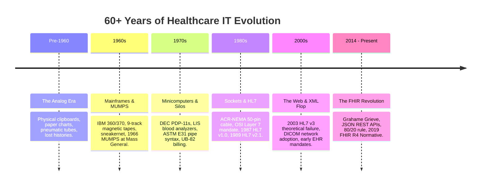
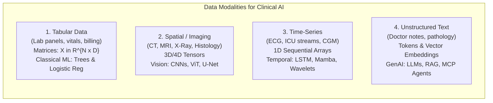

# Health Data & AI Foundations: The 2 + 1 Phase Master Narrative

> **Comprehensive Teaching Reference & Instructor Guide**  
> Workshop: *Orientation & Intro to AI in Health Foundations* (10:00 – 12:00)  
> Venue: Library Studio Room | Audience: 20 Engineering Undergraduates (IT, Agriculture, Mechanical)

---

## Executive Structure: The "2 + 1" Phase Architecture

The 120-minute morning session is divided into two core theoretical pillars and one dedicated research spotlight:

```
+-----------------------------------------------------------------------------------+
|  PHASE 1: HISTORY OF MEDICAL & HOSPITAL IT SYSTEMS (45 mins)                      |
|  Pre-1960 Paper ──> 1960s Mainframe ──> 1970s Silos ──> 1987 HL7 ──> 2014+ FHIR   |
+-----------------------------------------------------------------------------------+
                                          │
                                          ▼
+-----------------------------------------------------------------------------------+
|  PHASE 2: EVOLUTION OF CLINICAL DATA MODALITIES FOR ML & AI (45 mins)             |
|  1. Tabular (Classical ML) ──> 2. Spatial (Imaging) ──> 3. Time-Series ──> 4. Text |
|  (The Data Impedance Mismatch, LLMs, Context Formats: Markdown, RAG, and MCP)     |
+-----------------------------------------------------------------------------------+
                                          │
                                          ▼
+-----------------------------------------------------------------------------------+
|  PHASE +1: AIT RESEARCH IN ACTION — TELEHEALTH & WP1 (15 - 20 mins)               |
|  [Dedicated Spotlight for Dr. Chaklam Silpasuwanchai / AIT Brain Lab]             |
|  Telehealth Project ──> WP1 Non-Invasive Raman Glucose POC ──> Mapping to FHIR    |
+-----------------------------------------------------------------------------------+
```

---

# PHASE 1: History of Medical & Hospital IT Systems (Pre-1960 to Today)

To understand why healthcare data is complex today, engineering students must understand how healthcare arrived at this point through 60 years of technological evolution.



---

### 1. Pre-1960: How Hospitals Kept Records Before Digital
* **Physical Paper Charts & Manifold Files:** Patient histories lived in physical cardboard folders stored in basement medical record rooms.
* **Clipboards at the Bed Foot:** Vital signs and drug administration were scribbled manually by nurses onto paper flowsheets attached to the bed.
* **Pneumatic Tube Systems:** When a physician needed a blood test, an orderly drew blood, attached a paper requisition slip, placed it into a cylindrical pneumatic canister, and sent it shooting through pneumatic vacuum tubes across hospital walls into the basement lab.
* **The Clinical Failure Mode:** If a patient was moved between wards or visited a different clinic, their chart had to be physically transported by courier. Records were frequently lost, misfiled, stained, or destroyed in hospital fires. Two doctors treating the same patient had no way to see each other's notes in real time.

---

### 2. The 1960s: Mainframes, Punch Cards, and "Sneakernet"
* **The Arrival of Computing:** In the early 1960s, large academic medical centers purchased giant IBM 360/370 mainframes.
* **Storage Medium:** Data was stored on 80-column Hollerith punch cards and 9-track magnetic tape reels.
* **The "Sneakernet":** No computer networks existed. When a hospital submitted claims to Medicare or Blue Cross, IT technicians wrote batch files to magnetic tape reels, loaded them into the trunk of a car, and physically drove them to the insurance clearinghouse.
* **1966 — The Birth of MUMPS:**
  * Created by Neil Pappalardo and Dr. Octo Barnett at Massachusetts General Hospital (MGH).
  * **MUMPS** (*Massachusetts General Hospital Utility Multi-Programming System*) was both a programming language and an embedded hierarchical multi-user database.
  * Unlike relational databases that require fixed schemas, MUMPS used dynamic sparse tree globals (`^PATIENT(1234, "LAB", "GLUCOSE") = 105`).
  * **Legacy:** MUMPS became the operating system of healthcare. The US Veterans Affairs nationwide **VistA** hospital network was built on MUMPS. Even today, **Epic Systems** (which holds over 40% of US hospital records) runs its core database engine (**Epic Caché / InterSystems IRIS**) on a direct descendant of 1966 MUMPS!

---

### 3. The 1970s: Minicomputers, Departmental Silos, and Early Lab Standards
* **The Minicomputer Revolution:** In the 1970s, Digital Equipment Corporation (DEC) released minicomputers like the **PDP-11** and **VAX**.
* **The Birth of Departmental Silos:** Individual hospital departments no longer had to share the central mainframe. Departments began buying their own localized computer systems:
  * Pathology purchased specialized blood analyzers with serial ports.
  * Pharmacy bought drug dispensing computers.
  * Radiology bought early computerized tomography (CT) scanners.
* **ASTM Committee E31 (The Father of HL7 Syntax):**
  * Automated biochemistry analyzers needed to send blood readings to lab computers over RS-232 serial cables.
  * The *American Society for Testing and Materials* (ASTM) standardized **ASTM E1238 / E1394**.
  * **Crucial Historical Link:** ASTM E1238 invented the **pipe and caret (`|` and `^`) delimiter syntax**! When HL7 was formed a decade later, it adopted this exact delimiter grammar directly from ASTM.
* **UB-82 (Uniform Bill 1982):** Standardized paper and fixed-width ASCII tape layouts for hospital billing.

---

### 4. The 1980s: The Networking Crisis, OSI Layer 7, and HL7 Version 1.0 / 2.1
By the mid-1980s, local area networks (LANs) connected computers via coaxial cable. But hospitals faced a nightmare:

#### A. The Point-to-Point ($N(N-1)/2$) Trap
Every vendor machine had a proprietary protocol. Connecting 10 machines required 45 custom interface bridges. Upgrading one machine broke twelve others.

#### B. The ACR-NEMA 50-Pin Cable (Pre-DICOM, 1985)
When CT and MRI scanners went digital, the American College of Radiology and NEMA published **ACR-NEMA 300-1985**. It did not run over Ethernet; it required a **massive, custom 50-pin copper cable** running directly from the scanner to a review workstation! (In 1993, this evolved into **DICOM** over TCP/IP).

#### C. The OSI Layer 7 Mandate & The Birth of HL7 (1987)
* Networking protocols (Ethernet, TCP/IP) solved **Layers 1 through 4** of the OSI 7-layer model (moving raw packets between IP addresses).
* But when an automated blood analyzer streamed packets to an EHR, the receiving application had no idea whether the bytes represented a patient's potassium level or a billing fee.
* In **March 1987**, a committee met at the **Hospital of the University of Pennsylvania (HUP)** led by Dr. Sam Schultz and Dr. Ed Hammond (Duke).
* They named their organization **Health Level Seven (HL7)** specifically because they were solving **OSI Layer 7 (Application Layer)** for healthcare!
* **October 1987:** Published **HL7 Version 1.0** (an 84-page draft/prototype for Admission, Discharge, Transfer - ADT).
* **1989:** Released **HL7 Version 2.1** — the first production release widely adopted by commercial hospital vendors.
* **The Wire Protocol (MLLP):** Transmitted over raw TCP sockets wrapped with minimal control bytes (`0x0B` start, `0x1C 0x0D` end).

#### D. Technological Relativity: Why HL7 v2 Was Built for 1989
Why didn't they use JSON or REST APIs?
* In 1989, the World Wide Web did not exist (HTTP was 1991, REST was 2000, JSON was 2001).
* Hardware had 1–4 Megabytes of RAM and 10 Mbps coax Ethernet.
* Pipe-delimited ASCII allowed streaming parsers to split fields in $O(1)$ memory without allocating heap buffers. It was an engineering triumph for its era!

---

### 5. 2003: The Cautionary Tale of HL7 Version 3
* In the late 1990s, HL7 attempted to build a mathematically "perfect" standard: **HL7 v3**.
* It was built on a massive abstract object-oriented model (the Reference Information Model, or RIM) and serialized in heavy XML.
* **The Historic Flop:** It was so overwhelmingly complex, bloated, and academic that software engineers refused to implement it. Hospitals stuck with HL7 v2, and HL7 v3 became one of the most famous over-engineering failures in software history.

---

### 6. 2014 – Present: Enter HL7 FHIR (Fast Healthcare Interoperability Resources)
* In 2011, Australian software engineer **Grahame Grieve** led a fresh reboot: *"What if we designed health data using the modern web technologies that run Google, Amazon, and Twitter?"*
* **The Principles of FHIR (2014):**
  1. **Web-Native:** Standard HTTP REST endpoints, JSON payloads, OAuth 2.0 / OpenID Connect security.
  2. **Resources as URLs:** `GET /Patient/P0001`, `GET /Observation?code=2339-0`.
  3. **The 80/20 Rule:** Standardize the 80% of data common across all healthcare globally; isolate the remaining 20% into validated **Extensions**.
  4. **2019 — FHIR R4 (Normative):** Core clinical resources were frozen with guaranteed backwards compatibility forever. This is the version used in our workshop.

---

### 7. FHIR, The Semantic Web & Knowledge Representation & Reasoning (KRR)
* **FHIR as Production Semantic Web:** FHIR represents the single largest production deployment of W3C Semantic Web and Linked Data principles:
  1. **Universal Resource Identifiers (URIs):** Nothing in FHIR is an ambiguous loose string. Every coded concept, coding system, and structural extension is anchored to a globally resolvable URI (e.g. `http://loinc.org|2339-0`, `http://snomed.info/sct|439401001`).
  2. **RDF Triples in Practice:** FHIR resource references form directed graph triples:
     $$\text{Subject } (\texttt{Observation/obs-01}) \xrightarrow{\text{Predicate } (\texttt{subject})} \text{Object } (\texttt{Patient/P0001})$$
     This enables infinite multi-hop graph traversal across distributed EHR nodes without data duplication.
  3. **W3C RDF/Turtle Standard:** HL7 and the W3C jointly standardized the official FHIR RDF specification (`fhir/rdf.html`), allowing entire hospital populations to be indexed and queried as a unified knowledge graph via SPARQL.
* **Knowledge Representation & Reasoning (KRR):**
  1. **Formal Description Logics (SNOMED CT):** SNOMED CT is mathematically structured in Description Logics (the $\mathcal{EL}^{++}$ tractable profile of OWL 2). Concepts are defined using formal relationships, existential quantifications, and subsumption hierarchies (`Is-A`).
  2. **Automated Subsumption Inference:** If an AI clinical safety rule specifies:
     $$\text{Alert if patient has } \texttt{Respiratory Infection}$$
     an automated Description Logic reasoner infers that:
     $$\texttt{Bacterial Pneumonia} \sqsubseteq \texttt{Infectious disease of lung} \sqsubseteq \texttt{Respiratory Infection}$$
     and automatically fires the safety alert—even if the exact string *"Respiratory Infection"* never appears in the patient's record!
  3. **Pragmatic KRR Success:** FHIR succeeded where 2000s academic Semantic Web stalled: it concealed rigorous Description Logics and RDF graph semantics beneath clean, developer-friendly JSON REST APIs that modern web and AI developers can immediately build upon.

---

# PHASE 2: Evolution of Clinical Data Modalities for ML & AI

When non-medical engineers think of "clinical AI," they often picture a single monolithic algorithm. In reality, healthcare data spans **four distinct modalities**, each requiring completely different mathematical abstractions and machine learning architectures.



---

### Modality 1: Tabular Data (The Classical ML Engine)
* **What It Is:** Laboratory test batteries (blood glucose, electrolyte panels, biopsy morphometry, white blood cell counts), patient demographics (age, sex), and vital signs.
* **Mathematical Representation:** Rigid 2D rectangular feature matrix $X \in \mathbb{R}^{n \times d}$ and target label vector $y \in \{0, 1\}^n$.
* **Algorithms:** Logistic Regression, Random Forest, XGBoost, Support Vector Machines, k-Means Clustering.
* **The Core Workshop Link:** In this afternoon's hands-on workshop, students will take real breast cancer fine-needle aspirate biopsies and train Logistic Regression and Random Forest models on a 30-feature tabular matrix.

---

### Modality 2: Spatial & Imaging Data (Computer Vision & Radiology)
* **What It Is:** 2D Radiographs (Chest X-Rays), 3D volumetric cross-sections (CT scans, MRI sequences), and multi-gigabyte whole-slide pathology images (WSI).
* **Format Standard:** **DICOM** (Digital Imaging and Communications in Medicine), carrying pixel arrays and calibration metadata (voxel slice thickness, photometric interpretation).
* **Mathematical Representation:** 2D, 3D, or 4D tensors:
  $$\text{Image Tensor} \in \mathbb{R}^{C \times D \times H \times W}$$
* **Algorithms:** Convolutional Neural Networks (ResNet, EfficientNet), Vision Transformers (ViT), and encoder-decoder segmentation architectures (U-Net) for tumor contouring.

---

### Modality 3: Time-Series & Continuous Telemetry (Signal Processing & Physiological Streams)
* **What It Is:** High-frequency electrical and mechanical telemetry:
  * Intensive Care Unit (ICU) multi-parameter waveforms (continuous arterial blood pressure, capnography, intracranial pressure).
  * 12-lead Electrocardiography (ECG) and Electroencephalography (EEG).
  * Continuous Glucose Monitors (CGM) and wearable photoplethysmography (PPG).
* **Mathematical Representation:** 1D sequential arrays sampled at uniform intervals (e.g. 250–500 Hz), frequency spectra via Fast Fourier Transform (FFT) or continuous wavelet transforms.
* **Algorithms:** Long Short-Term Memory (LSTM) networks, 1D Temporal Convolutional Networks (TCN), and modern State Space Models (Mamba) for sepsis early warning.

---

### Modality 4: Unstructured Text & Clinical Narratives ("What 90% Mean by AI Today")
* **What It Is:** Doctor progress notes, nursing shift handoffs, discharge summaries, operative reports, and radiology impressions.
* **The Modern GenAI Paradigm:** In 2026, when clinicians or tech executives say "AI," 90% of the time they are referring to **Generative AI, Large Language Models (LLMs), and Clinical AI Agents**.
* **Clinical Models:** Med-PaLM 2, BioGPT, ClinicalGPT, and ambient scribing tools that listen to doctor-patient speech and auto-draft EHR encounters.

---

### The New Formatting Dilemma: Why LLMs Choke on Raw FHIR JSON
If an engineer attempts to feed raw FHIR JSON directly into an LLM prompt:
1. **Severe Token Bloat:** A single FHIR `Observation` takes 300–500 tokens of schema metadata (`resourceType`, `system`, `coding`, `valueQuantity`). A patient encounter chart easily consumes **50,000+ tokens** of syntactic boilerplate!
2. **Context Degradation & Hallucination:** LLMs perform poorly when key clinical numbers are diluted across hundreds of curly braces.

#### The Emerging Solutions:
* **Clean Markdown (`.md`):** Converting FHIR JSON into compact markdown tables and bulleted lists. **Reduces token consumption by 60–75%** while dramatically boosting LLM factual recall.
* **Retrieval-Augmented Generation (RAG):** Splitting free-text clinical notes and medical guidelines into semantic chunks, generating vector embeddings, and indexing them in vector databases (pgvector, Chroma) for fast semantic search.
* **Model Context Protocol (MCP):** AI agents do not read entire hospital charts; they use structured tool-calling endpoints (`get_patient_labs(id, 'glucose')`) to fetch exactly what they need deterministically.

---

### The Next Frontier: Towards AI-Native Health Data Standards
Healthcare is entering its third great epoch:
* **Era 1 (1989–2011):** Machine-to-Machine Sockets (HL7 v2 ASCII pipes).
* **Era 2 (2014–2025):** Clinician & App REST APIs (HL7 FHIR JSON).
* **Era 3 (2026+):** AI-Native Autonomous Systems.

#### The Dual-Stack Health Architecture:
* **System of Record (FHIR):** Remains the authoritative, legally audited, and human-verified patient ledger for billing, medication safety, and clinical charts.
* **System of Intelligence (AI Feature Store & Vector DB):** Ingests real-time FHIR streams, computes vector embeddings, manages tabular feature stores (e.g. Feast), and serves machine learning models and LLM agents with sub-millisecond latency.

---

# PHASE +1: AIT Research in Action — Telehealth & WP1 (10–20 Mins for Dr. Chaklam)

> **Pedagogical Goal:** Show the 20 engineering students that these global standards and ML modalities are not abstract theoretical concepts from Silicon Valley—**we are actively building them right here at AIT!**

```
+-----------------------------------------------------------------------------------+
|  AIT TELEHEALTH MONITORING AND ASSISTIVE SYSTEMS PROJECT                          |
|  Principal Investigator: Prof. Chaklam Silpasuwanchai | AIT Brain Lab             |
+-----------------------------------------------------------------------------------+
   │
   ├── WP1: Non-Invasive Optical Glucose Sensing (Raman Spectroscopy & Edge ML)
   ├── WP2: Human Activity & Fall Detection (Computer Vision & Wi-Fi CSI Telemetry)
   ├── WP3: Remote Physical Rehabilitation (Robotic Haptic Force-Feedback)
   └── WP4: Cloud Telehealth & Clinical Integration (Secure FHIR Microservices)
```

---

### 1. Overview of the Four AIT Work Packages (WPs)

1. **Work Package 1 (WP1) — Non-Invasive Glucose Sensing:**
   * Eliminating painful finger-prick blood draws for elderly and diabetic patients using **optical Raman laser spectroscopy** and edge machine learning calibration.
2. **Work Package 2 (WP2) — Fall & Activity Monitoring:**
   * Detecting falls and abnormal mobility in elderly residents using privacy-preserving computer vision and ambient Wi-Fi Channel State Information (CSI) disturbance analysis.
3. **Work Package 3 (WP3) — Remote Haptic Therapy:**
   * Upper-limb robotic rehabilitation devices with programmable force-feedback, allowing physiotherapists to guide stroke recovery remotely.
4. **Work Package 4 (WP4) — Cloud Telehealth Platform:**
   * Unifying all three edge sensor streams into a secure, HIPAA/PDPA-compliant cloud platform with real-time clinician dashboards.

---

### 2. Deep Dive: WP1 Non-Invasive Blood Glucose & The POC App

* **Project Repository:** [`github.com/akraradets/BloodGlucose-App`](https://github.com/akraradets/BloodGlucose-App)
* **The Physical Principle:**
  * Conventional glucose monitoring requires chemical test strips and finger-prick blood drops.
  * In WP1, a 785 nm near-infrared laser shines through the skin. Photons inelastic-scatter off glucose molecules in interstitial fluid, producing a unique **Raman spectral fingerprint** (peaks around 1125 cm⁻¹).
* **The Machine Learning Challenge (Modality 3 → Modality 1):**
  * Raw Raman spectra are high-dimensional 1D continuous curves contaminated by skin autofluorescence, melanin absorption, and sensor noise.
  * Preprocessing: Baseline polynomial subtraction, cosmic ray removal, Standard Normal Variate (SNV) scaling.
  * Calibration Model: Partial Least Squares (PLS) regression and Random Forests map the spectral intensity vectors directly to a blood glucose concentration ($mg/dL$).
* **The Mobile POC App:**
  * Runs on Android/iOS connecting over Bluetooth Low Energy (BLE) to the Raman sensor spectrometer.
  * Calculates real-time glucose and visualizes trends for elderly patients.

---

### 3. Closing the Circuit: Mapping the AIT Raman Reading into FHIR R4

Once the AIT Raman sensor calculates a glucose value of **118 mg/dL**, how does that reading safely enter the hospital EHR without being rejected?

It serializes directly into a standard **FHIR R4 Observation**:

```json
{
  "resourceType": "Observation",
  "id": "ait-raman-glucose-001",
  "status": "final",
  "category": [
    {
      "coding": [
        {
          "system": "http://terminology.hl7.org/CodeSystem/observation-category",
          "code": "laboratory",
          "display": "Laboratory"
        }
      ]
    }
  ],
  "code": {
    "coding": [
      {
        "system": "http://loinc.org",
        "code": "2339-0",
        "display": "Glucose [Mass/volume] in Blood"
      }
    ],
    "text": "Blood Glucose via Optical Raman Spectroscopy"
  },
  "subject": {
    "reference": "Patient/P0001",
    "display": "Jane Doe"
  },
  "effectiveDateTime": "2026-09-09T10:30:00+07:00",
  "valueQuantity": {
    "value": 118,
    "unit": "mg/dL",
    "system": "http://unitsofmeasure.org",
    "code": "mg/dL"
  },
  "referenceRange": [
    {
      "low": { "value": 70, "unit": "mg/dL" },
      "high": { "value": 99, "unit": "mg/dL" }
    }
  ],
  "method": {
    "coding": [
      {
        "system": "http://snomed.info/sct",
        "code": "439401001",
        "display": "In-vivo Raman spectroscopy (procedure)"
      }
    ]
  },
  "device": {
    "display": "AIT WP1 Raman Spectrometer Device v1.2"
  }
}
```

* **LOINC `2339-0`:** Guarantees that *any* EHR in the world interprets the number as a blood glucose mass concentration.
* **SNOMED CT `439401001`:** Explicitly tells the receiving hospital that this was measured non-invasively via Raman spectroscopy, not a venous draw or a finger prick.
* **UCUM `mg/dL`:** Eliminates lethal unit ambiguity between US ($mg/dL$) and European ($mmol/L$) systems.

This brings the morning theory full circle: **from 1960s paper clipboards, through HL7 and FHIR standards, across the 4 ML modalities, directly into hardware and software engineered at AIT!**
