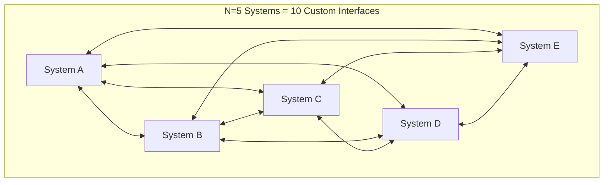
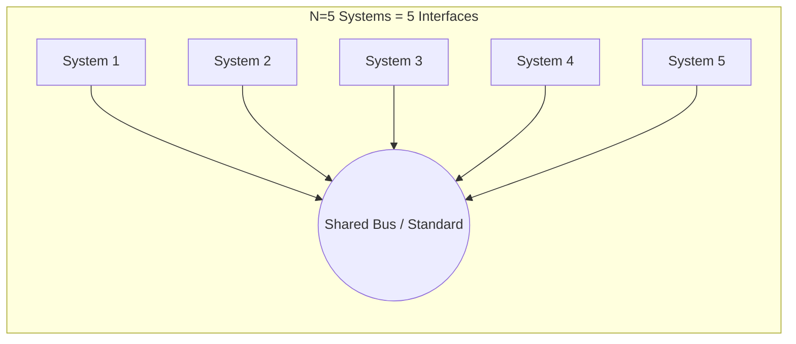
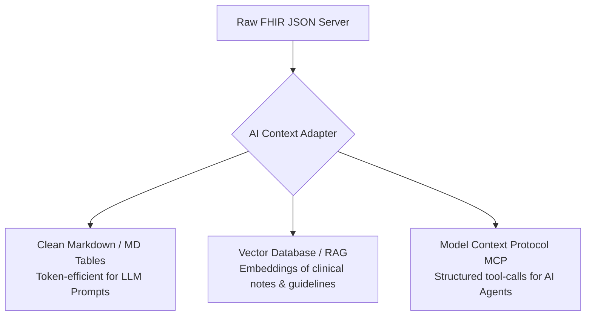

# The Evolution of Health Data & AI: From Distributed Networks to AI-Native Standards

> **Comprehensive Narrative & Instructor Scratchpad**  
> Workshop: *Orientation & Intro to AI in Health Foundations*  
> Venue: Library Studio Room | Target Audience: 20 Engineering Undergraduates (IT, Agriculture, Mechanical)

---

## Narrative Overview: The 9-Stage Story Arc

```
1. Distributed Information Management (P2P vs. Shared Contracts)
   │
   ▼
2. The Healthcare Sector: Extreme Departmental Fragmentation
   │
   ▼
3. OSI Layer 7 (Application Layer) & The HL7 Mandate
   │
   ▼
4. Technological Relativity: Why HL7 v2 Was Built for 1989 (and Why REST Wasn't)
   │
   ▼
5. Today's Reality: HL7 FHIR (HTTP REST, JSON, Web Standards)
   │
   ▼
6. The New Dilemma: Is FHIR R4 Actually "AI-Ready"?
   │
   ▼
7. Classical Machine Learning: The Statistical Data Impedance Mismatch
   │
   ▼
8. The GenAI Era: LLMs, Agents, RAG, and Modern Context Formats (MCP, MD)
   │
   ▼
9. The Next Frontier: The Emergence of AI-Native Health Data Architectures
```

---

## Stage 1: Information Management & Distributed Data Exchange

Before diving into medicine, consider how any two software systems exchange state and coordinate actions:

### 1. Point-to-Point (Peer-to-Peer) Topology: The $N(N-1)/2$ Explosion
When multiple independent systems need to exchange data without a common standard, the intuitive first instinct is to write custom connectors between pairs:



* For $N$ systems, the number of bespoke pairwise interfaces scales quadratically:
  $$\text{Interfaces} = \frac{N(N-1)}{2}$$
* In a 50-system enterprise, this requires **1,225 separate custom integrations**.
* **Failure Mode:** A single schema change in System A cascades breaking changes across dozens of fragile, undocumented translation scripts.

### 2. Hub-and-Spoke / Message Bus: Linear Scalability
To avoid the $N^2$ trap, distributed systems introduce a shared intermediary (an Enterprise Service Bus or Message Broker):



* Complexity drops from $O(N^2)$ to $O(N)$.
* **The Catch:** Every system must agree on a common **interface contract** (serialization format, transmission protocol, and data model).

---

## Stage 2: Why Healthcare Fragmented Faster Than Any Other Sector

Other industries standardized their data exchange decades ago:
* **Finance:** Adopted **SWIFT** and **FIX** protocols because transactions are mathematically homogeneous (debits, credits, currency amounts, account IDs).
* **Retail & Logistics:** Adopted **EDIFACT** and barcodes because shipping containers, pallets, and stock keeping units (SKUs) follow physical geometry.

### Why Healthcare Failed to Consolidate:
1. **Biological Complexity & Heterogeneity:** A human body is not a bank account. Data types range from real-time high-frequency telemetry (ICU ECG waveforms), to high-resolution 3D imaging (CT/MRI), qualitative histopathology slide descriptions, genomic sequences, and psychosocial narratives.
2. **Departmental Procurement Silos:** Over 50 years, hospitals did not buy "one hospital operating system." Each specialized department purchased its own best-in-class hardware from different niche vendors:
   * **Radiology** bought specialized imaging workstations (**RIS/PACS**).
   * **Pathology & Biochemistry** bought robotic automated blood analyzers (**LIS**).
   * **Inpatient Wards** bought nursing charting software (**EHR/EMR**).
   * **Finance** bought accounting and claims software.
3. **Extreme Reliability & High Asymmetric Risk:** Hospitals operate 24/7/365 with zero tolerance for scheduled downtime. An error in patient identification or allergy charting is fatal. Consequently, legacy software installed in the 1990s was kept running permanently because *"it never crashed."*

The result: Hospitals became the world's most acute example of the $N(N-1)/2$ point-to-point integration spaghetti.

---

## Stage 3: Focusing on OSI Layer 7 (The Application Layer) & The HL7 Mandate

In computer networking, the **OSI 7-Layer Model** defines how data travels from physical wires to user software:

| OSI Layer | Name | What It Solves | Healthcare Example |
|---|---|---|---|
| **Layer 1–4** | Physical, Data Link, Network, Transport | Moving raw bits and packets between IP addresses | Ethernet, Wi-Fi, TCP/IP sockets |
| **Layer 5–6** | Session, Presentation | Managing connections, encryption, and encoding | TLS 1.3, UTF-8 |
| **Layer 7** | **Application Layer** | **What does the data actually MEAN to the software?** | **Is this payload a patient's temperature or a billing invoice?** |

```
+-------------------------------------------------------------+
| Layer 7: APPLICATION LAYER                                  |
| "Patient P0001 has Blood Glucose of 105 mg/dL"             | <--- HL7 FOCUS
+-------------------------------------------------------------+
                              |
+-------------------------------------------------------------+
| Layers 1-4: TRANSPORT & NETWORKING                          |
| "Stream 1,024 bytes over TCP port 2575 to 192.168.1.50"    | <--- TCP/IP SOLVED
+-------------------------------------------------------------+
```

* In the 1980s, networking protocols (Ethernet, TCP/IP) successfully solved Layers 1 through 4. Computers could reliably send packets to each other.
* However, when a blood analyzer sent a packet to an EHR, the receiving application had no idea how to interpret the payload.
* In **1987**, a committee of hospital clinicians and IT directors formed **Health Level Seven International (HL7)**. The name was chosen deliberately: **they were specifically standardizing Layer 7 of the OSI model for healthcare.**

---

## Stage 4: Technological Relativity: Why HL7 v2 Was Built for 1989 (and Why REST Wasn't)

From the vantage point of 2026, students and engineers look at HL7 v2 and ask:
> *"Why did they make it so ugly with pipes (`|`) and hats (`^`)? Why didn't they just use a JSON REST API?"*

This is a classic trap in software engineering: forgetting **technological context**.

### The Computing Environment of 1989:
* **The Web Did Not Exist:** Tim Berners-Lee circulated his initial proposal for the World Wide Web in March 1989. The first HTTP specification (HTTP v0.9) was not published until 1991.
* **No JSON, No REST:** Roy Fielding formalized the REST architectural style in his doctoral dissertation in the year **2000**. Douglas Crockford specified JSON in **2001**.
* **Severe Hardware Constraints:**
  * Typical hospital servers were 16-bit or early 32-bit machines (Intel 80286/80386) with **1 to 4 Megabytes of RAM**.
  * Network connections were 10 Mbps shared coaxial Ethernet (10BASE2) or serial RS-232 cables.
  * Storing and parsing verbose ASCII markup (like XML or JSON with repetitive keys) would have completely choked network cards and depleted CPU cycles.

### The Genius of HL7 v2 for Its Era:
HL7 v2 was an **engineering masterpiece for 1989**:
```text
MSH|^~\&|LAB_SYS|HOSP_A|EMR|HOSP_A|20260909100000||ORU^R01|MSG001|P|2.5
PID|1||P0001^^^MRN||DOE^JOHN||19800101|M
OBX|1|NM|2339-0^Glucose [Mass/vol] in Blood^LN||105|mg/dL|70-99|H|||F
```
* **Zero Overhead:** No opening or closing tags. Delimiters (`|`, `^`, `~`, `\`, `&`) allowed streaming parsers to split fields in $O(1)$ memory by advancing a pointer directly in a C buffer.
* **Raw Socket Transport:** Transmitted over bare TCP streams using Minimal Lower Layer Protocol (MLLP) with single-byte framing (`0x0B` start block, `0x1C 0x0D` end block).
* **Massive Success:** It spread across the entire planet. Over **80% of internal hospital interface transactions still run on HL7 v2 today** because it is blazingly fast and rarely fails.

### The Trade-off: Integration Debt & Z-Segments
Because v2 was designed for point-to-point messaging between trusted local machines:
1. It allowed vendors to define arbitrary custom segments (**"Z-segments"**).
2. Almost every field was marked optional.
3. Over 30 years, every hospital implemented v2 slightly differently, requiring expensive middleware (like Mirth Connect / NextGen Connect) to translate between "Hospital A's flavor of v2" and "Hospital B's flavor of v2."

---

## Stage 5: Today's Reality: HL7 FHIR (HTTP REST, JSON, Web Standards)

By 2011, the global computing environment had completely transformed:
* High-speed broadband, mobile smartphones (smartphones in every pocket), cloud computing, and microservice architectures dominated tech.
* A younger generation of software developers refused to learn 1980s pipe-delimited serial protocols.
* In 2011, Australian software architect **Grahame Grieve** led the creation of **FHIR (Fast Healthcare Interoperability Resources)**.

### What FHIR Represents:
1. **Web-Native Architecture:** Built entirely on standard internet technologies: **HTTP, REST, JSON/XML, OAuth 2.0 / OpenID Connect, and TLS**.
2. **Modular "Resources":** Deconstructs healthcare into discrete building blocks (`Patient`, `Observation`, `Condition`, `Encounter`, `MedicationRequest`).
3. **URL-Addressable Endpoints:**
   ```http
   GET https://api.hospital.org/fhir/r4/Observation?patient=P0001&code=2339-0
   ```
4. **The "80/20 Rule":** Focus strictly on the 80% of clinical data concepts shared across all medicine worldwide. Handle the remaining 20% through structured, explicitly validated **Extensions**.
5. **Modern Developer Experience:** Clean documentation, free public test servers (HAPI FHIR), and instant client libraries in Python, JavaScript, Go, and Java.

FHIR solved the modern application problem: it allowed iPhone apps (like Apple Health) and web portals to securely fetch records from any compliant hospital.

---

## Stage 6: The New Dilemma: Is FHIR R4 Actually "AI-Ready"?

With the rise of Machine Learning and Large Language Models, healthcare systems hit a brand new architectural dilemma:

> **The Question:** *"We standardized our data in FHIR R4. Does that mean our hospital is now ready for Artificial Intelligence?"*  
> **The Answer:** **No. FHIR was designed for transactions, not for machine learning.**

### Why FHIR is Built for OLTP, NOT OLAP or AI:

| Dimension | FHIR R4 Design Objective (OLTP) | AI & Machine Learning Requirements (OLAP / Vectors) |
|---|---|---|
| **Access Pattern** | Single patient lookup; CRUD operations on one record (`GET /Patient/123`). | Batch processing; scanning millions of historical patient records simultaneously. |
| **Data Topology** | Highly nested, hierarchical, tree-structured graph with circular references. | Flat, dense rectangular 2D matrices ($X \in \mathbb{R}^{n \times d}$) or continuous embedding spaces. |
| **Payload Size** | Verbose JSON with deep metadata, system URIs, and audit headers (5–10 KB per lab test). | Compact numeric vectors ($[0.42, -1.89, 0.05]$) or dense tensors. |
| **Query Engine** | Relational document stores querying by Patient ID or timestamp. | Vector similarity search (k-NN), matrix multiplications, gradient descent. |

FHIR solves **interoperability between applications and clinicians**, but it was never optimized for statistical model training.

---

## Stage 7: Classical Machine Learning: The Statistical Data Impedance Mismatch

Classical supervised and unsupervised machine learning models (Logistic Regression, Random Forests, XGBoost, Support Vector Machines, k-Means) rely on fundamental statistical theorems.

### 1. The Core ML Requirement: Rectangular Matrices
To train a model, mathematical algorithms require a 2D tabular feature matrix and a label vector:
$$X \in \mathbb{R}^{n \times d}, \quad y \in \{0, 1\}^n$$
Where:
* $n$ = Number of distinct patients / encounters (rows).
* $d$ = Fixed feature attributes (columns) aligned across all samples.

### 2. The Clinical Data Reality: Event Streams
In real life, patients do not exist as flat spreadsheet rows. A patient's health record is a **sparse, irregularly sampled temporal event stream**:
* Patient A had 5 glucose checks today because they were in diabetic ketoacidosis.
* Patient B had 0 glucose checks because they were healthy.
* Patient C had an ultrasound, 2 prescriptions, and a consultation note.

### 3. The Data Impedance Mismatch in Action:
```
[ Hierarchical FHIR Bundle ]
   ├── Patient Resource
   ├── Observation 1 (Glucose: 105 mg/dL @ 08:00)
   ├── Observation 2 (Systolic BP: 120 mmHg @ 08:00)
   └── Observation 3 (Diastolic BP: 80 mmHg @ 08:00)
                  │
                  ▼  [ FEATURE ENGINEERING & FLATTENING PIPELINE ]
                  │  (e.g., scripts/01_fhir_to_table.py)
                  │
[ Tabular Matrix X for Scikit-Learn ]
+------------+--------------------+----------------+-----------------+
| Patient_ID | mean_blood_glucose | systolic_bp    | label_malignant |
+------------+--------------------+----------------+-----------------+
| P0001      | 105.0              | 120.0          | 0               |
| P0002      | NaN (missing!)     | 135.0          | 1               |
+------------+--------------------+----------------+-----------------+
```

> **Why this matters for your students:**  
> In Step 1 of this afternoon's hands-on workshop, students will write a Python script ([`scripts/01_fhir_to_table.py`](file:///Users/akraradets/Projects/AIT-brainlab/fhir-ml-workshop/scripts/01_fhir_to_table.py)) specifically to resolve this impedance mismatch by extracting FHIR `Observation.code` and `valueQuantity` into tabular columns.

---

## Stage 8: The Generative AI Era: LLMs, Assistants, Agents, and Context Formats

In 2023–2026, artificial intelligence expanded far beyond classical tabular prediction models. Today's healthcare AI involves:
* **Large Language Models (LLMs):** Medical summarization, clinical question-answering, diagnostic reasoning (Med-PaLM, ClinicalGPT).
* **Ambient Clinical AI Assistants:** Microphones in the exam room listening to the doctor-patient conversation and auto-drafting clinical notes.
* **Autonomous AI Agents:** Systems that query lab records, check drug-drug interactions, and recommend orders.

### The New Formatting Challenge:
If you feed raw FHIR JSON directly into an LLM context window:
1. **Severe Token Bloat:** A single FHIR `Observation` can consume 300–500 tokens because of nested schema tags (`resourceType`, `meta`, `coding`, `system`, `valueQuantity`, `comparator`). Passing an entire patient chart easily consumes 50,000+ tokens of syntactic boilerplate.
2. **Context Degradation & Hallucination:** LLMs perform worse when key clinical numbers are buried inside repetitive JSON brackets.

### Emerging Context Formats for Generative Health AI:
To make healthcare data consumable by LLMs and AI Agents, the industry is converging on new conventions:



1. **Clean Markdown (`.md`):** Converting nested FHIR trees into clean, human-readable markdown tables and bulleted lists. Markdown reduces token usage by **60–75%** while dramatically improving LLM comprehension.
2. **Retrieval-Augmented Generation (RAG):** Splitting narrative clinical notes and medical guidelines into semantic chunks, converting them into vector embeddings, and indexing them in vector databases (e.g. pgvector, Chroma) for fast semantic search.
3. **Model Context Protocol (MCP) & Function Calling:** Instead of dumping an entire health record into the prompt, modern AI agents use structured MCP tools:
   * `get_patient_vitals(patient_id="P0001", time_range="last_24h")`
   * The agent only queries the exact FHIR resources it needs to answer the clinical question.

---

## Stage 9: The Next Evolution: Towards an "AI-Native" Health Data Standard

Just as the transition from local networks to the World Wide Web necessitated the leap from **HL7 v2 to FHIR R4**, the transition from human-operated web apps to autonomous AI workflows suggests that healthcare is entering its next architectural inflection point.

```
ERA 1: 1989 - 2011          ERA 2: 2014 - 2025          ERA 3: 2026+
[ Local Machine Era ]       [ Web & Mobile Era ]        [ Artificial Intelligence Era ]
Protocol: HL7 v2            Protocol: HL7 FHIR R4       Protocol: AI-Native / Hybrid Stack
Syntax:   Pipes & Hats      Syntax:   JSON REST         Syntax:   Embeddings, MCP & Token-Optimized MD
Target:   LAN TCP Sockets   Target:   Clinicians & Apps Target:   Statistical ML & Autonomous Agents
```

### What Will the Next Iteration Look Like?

1. **FHIR Evolution (AI Extensions & Native Profiles):**
   * Incorporating native vector representations directly into FHIR specifications (e.g., standard `Embedding` data types).
   * Standardizing **RiskAssessment** outputs so AI confidence intervals, calibration curves, and feature attribution metrics (SHAP values) are first-class citizens.
2. **The Dual-Stack Health Architecture:**
   * **The Legal & Transactional Layer (FHIR):** Remains the authoritative, auditable system of record for hospital billing, regulatory compliance, and human clinician viewing.
   * **The Semantic & Analytical Layer (AI Feature Store & Vector DB):** Continually ingests FHIR events, vectorizes unstructured notes, flattens longitudinal encounters into feature stores, and serves inference engines with sub-millisecond latency.
3. **Standardized Agentic Protocols (Health MCP):**
   * Just as HTTP unified web servers, standard agentic interfaces (such as Model Context Protocol servers for health data) will dictate how clinical AI agents safely authenticate, query patient history, and propose clinical decisions with full provenance and guardrails.

---

## Summary for Tomorrow's Morning Session

When addressing your 20 engineering students, this 9-part narrative gives them a complete intellectual journey:
* They begin with **systems engineering & networking** (topics they know: P2P, distributed buses, OSI Layer 7).
* They understand **why history unfolded the way it did** (why 1989 required v2, and why 2014 required FHIR).
* They see **the limits of current standards** (the data impedance mismatch between FHIR trees and ML matrices).
* They connect the morning theory directly to **today's cutting-edge AI revolution** (LLMs, RAG, MCP, and AI-native architectures).
* They walk into the afternoon hands-on session ready to build the exact pipeline that bridges this gap!
