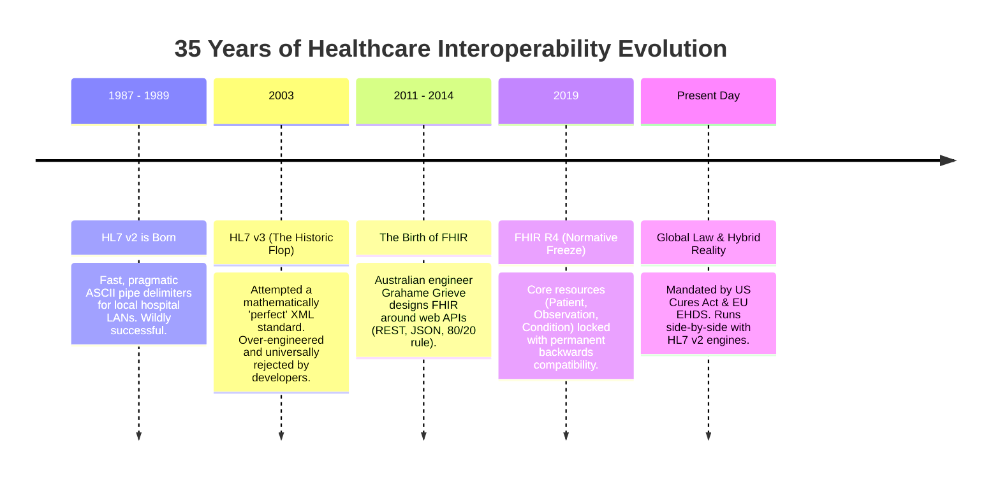

# Health Data Standards Scratchpad: HL7, FHIR & Healthcare Interoperability

> **Quick Reference Guide & Instructor Cheat Sheet**  
> Workshop: *Orientation & Intro to AI in Health Foundations*  
> Venue: Library Studio Room | Audience: 20 Engineering Students (IT, Agriculture, Mechanical)

---

## 1. Quick Executive Summary: The 2-Minute Pitch

If you only have 30 seconds to explain this to engineering students:

> *"In 1989, hospital machines started talking using **HL7 v2**—the serial cable / NMEA sentence of healthcare. It is fast, rugged, and ubiquitous, but brittle and filled with custom hacks.  
> Around 2014, healthcare reinvented itself with **HL7 FHIR**—the modern web API of medicine using HTTP REST, JSON, and standardized medical ontologies (LOINC, SNOMED CT).  
> Today, FHIR is what allows smartphone apps, cloud databases, and machine learning models to interface with hospital records without knowing the hospital's internal database schema."*

---

## 2. What are HL7 and FHIR in Plain English?

Think of hospital software like computer hardware:
* **The Problem:** In a typical hospital, the pharmacy system, the pathology laboratory, the MRI/CT scanners, the intensive care monitors, and the billing department are manufactured by entirely different vendors. Historically, none of them spoke the same language or shared a common database.
* **HL7 (Health Level Seven International):** A global non-profit standards organization founded in 1987 to establish common communication rules for healthcare.
  * *Why "Level 7"?* It refers to **Layer 7 (Application Layer)** in the standard ISO/OSI 7-layer networking model. It handles the application-level data payload, not the physical cabling or TCP transport.
* **HL7 v2 (1989):** The **legacy industrial serial protocol**.
  * Encoded as pipe-and-hat delimited ASCII text strings:
    ```text
    MSH|^~\&|LAB_SYS|HOSP_A|EMR|HOSP_A|20260909100000||ORU^R01|MSG001|P|2.5
    PID|1||P0001^^^MRN||DOE^JOHN||19800101|M
    OBX|1|NM|2339-0^Glucose [Mass/vol] in Blood^LN||105|mg/dL|70-99|H|||F
    ```
  * Works like industrial telemetry, GPS NMEA sentences, or automotive CAN-bus frames.
  * Designed in 1989 for point-to-point TCP sockets on local area networks.
* **HL7 FHIR (Fast Healthcare Interoperability Resources, pronounced *"fire"*, ~2014):** The **modern web standard**.
  * Built using the exact same technologies that power modern cloud platforms: **HTTP, REST, JSON, OAuth 2.0, and URL queries**.
  * Instead of parsing cryptic pipe delimiters over raw TCP sockets, any developer can send a standard web request:
    ```http
    GET https://hospital.org/fhir/r4/Observation?patient=P0001&code=2339-0
    ```
  * The server returns a standardized, human-readable, machine-validatable JSON payload.

---

## 3. Is this a Global Standard?

**Yes, unequivocally.**

* **Official International Accreditation:** HL7 standards and FHIR are accredited by **ISO** (International Organization for Standardization) and officially endorsed by the **WHO** (World Health Organization) for digital health architectures worldwide.
* **National Affiliate Chapters:** HL7 has official national chapters in more than **50 countries**, including:
  * HL7 USA, HL7 Europe, HL7 UK, HL7 Japan, HL7 Singapore, and **HL7 Thailand**.
* **Global Commercial Adoption:** If a hospital purchases modern commercial health IT software from major multinational vendors (such as **Epic Systems, Oracle Health / Cerner, Philips, Siemens Healthineers, GE Healthcare, or InterSystems**), it natively speaks HL7 v2 and FHIR out of the box.

---

## 4. What Do We Want to Achieve by Having a Standard?

Imagine if every smartphone brand used a proprietary charging port shape, a proprietary electrical voltage, and a proprietary data protocol, making it impossible to borrow a charger or plug into a USB port. That was healthcare before interoperability standards.

The primary goal is **Interoperability** (the "universal plug" for clinical data):

| Objective | Clinical & Engineering Reality |
|---|---|
| **1. Patient Safety** | When a patient is transferred from an emergency room to the ICU or to another hospital, their drug allergies, blood type, and active prescriptions must transfer instantaneously. Eliminates fatal medication errors caused by manual transcription. |
| **2. Eliminating Duplicate Costs** | If a patient underwent an expensive $500 blood panel or CT scan at Clinic A yesterday, Hospital B should access those results instantly rather than subjecting the patient to unnecessary repeated radiation or blood draws. |
| **3. Breaking Vendor Lock-In** | Hospitals avoid being held hostage by a single legacy software provider. Open APIs enable swapping or augmenting modular components. |
| **4. Unlocking Clinical AI** | Without standards, an AI diagnostic model trained in Hospital X must be rewritten from scratch to run in Hospital Y because the column names, database schemas, and unit representations differ. With FHIR, an AI model connects to *any* compliant hospital API worldwide. |

---

## 5. How Long Have We Had This? (The 35-Year Timeline)



### Key Milestones Explained:
* **1987 – 1989 (HL7 v2):** Designed by hospital IT administrators. Pragmatic, forgiving, and simple. It spread like wildfire and became the global backbone of hospital communications.
* **2003 (HL7 v3 — The Historic Flop):** A cautionary tale in software engineering. HL7 tried to design a mathematically pure, top-down theoretical model (the Reference Information Model, or RIM) serialized in verbose XML. It was so complicated that almost nobody could implement it correctly without expensive consultants. Developers abandoned it.
* **2011 – 2014 (The FHIR Revolution):** Australian software architect **Grahame Grieve** led a grassroots redesign asking: *"What would healthcare data look like if built by web developers using modern Internet standards?"* FHIR adopted REST, JSON, and human-friendly documentation.
* **2019 (FHIR Release 4 — Normative):** In December 2019, FHIR R4 was published. Core specifications achieved "Normative" status—guaranteeing that future versions will remain backwards compatible. This is the version utilized in our workshop.

---

## 6. Does Every Country Have This Yet?

Adoption exists along a global regulatory spectrum:

```
[ Traditional File-Sharing / Legacy v2 ] ----> [ Emerging National FHIR ] ----> [ Legally Mandated Open FHIR ]
  (Developing Health Systems)                     (Thailand, Singapore, JP)         (USA, EU / NHS)
```

### 1. Mandated by Law (USA, Europe, UK)
* **United States:** The federal **21st Century Cures Act** made "information blocking" illegal. All certified EHR vendors and hospitals are legally mandated to provide patients and authorized 3rd-party apps with secure, standardized FHIR APIs (SMART on FHIR). This is why Apple Health on the iPhone can directly download official medical records from thousands of US hospitals.
* **European Union & UK:** The **European Health Data Space (EHDS)** and the UK National Health Service (NHS Digital) require FHIR for regional health exchanges and cross-border European health records.

### 2. Rapid National Expansion (Thailand & Asia-Pacific)
* **Thailand:** The Ministry of Public Health (MOPH) and Thai health-tech agencies are actively rolling out national FHIR-based Health Information Exchanges (HIE) to connect provincial hospitals, district clinics, and the universal coverage digital claims system.
* **The Reality on the Ground:** While national policies target FHIR, individual provincial and private hospitals still rely heavily on legacy relational databases (MySQL, MS SQL Server, Oracle) and older HL7 v2 interface engines (like Mirth Connect). Upgrading a running hospital core database can cost millions of dollars, so FHIR is typically deployed as a modern **API gateway** wrapper over existing databases.

---

## 7. Why Is Healthcare Data STILL Not Perfect?

If smart engineers have worked on this for 35 years, why is clinical data still notoriously messy?

### Reason 1: The 30-Year Legacy Problem (High Availability)
Hospitals are not consumer tech startups—they cannot adopt a *"move fast and break things"* mindset. A hospital EHR system installed in 1998 that controls intensive care telemetry, blood transfusions, and drug dispensing cannot be shut down for a weekend refactor.
> **Reality:** HL7 v2 still carries **>80% of internal hospital interface traffic today** because it is battle-tested, fast, and does not crash. FHIR is usually installed *in front of* HL7 v2 as a web-facing integration layer.

### Reason 2: The "80/20 Rule" and Custom Extensions
FHIR intentionally standardizes only the **80%** of data fields common across all medical disciplines worldwide (e.g., patient demographics, standard vital signs, diagnoses, lab panels).
* The remaining **20%** consists of specialized, localized clinical data (e.g., novel genomic markers, specialized chemotherapy protocols, country-specific insurance numbers).
* FHIR handles this through **Extensions**. If Hospital A and Hospital B design custom extensions differently for the same concept, seamless out-of-the-box interoperability breaks down without custom mapping.

### Reason 3: The Syntactic vs. Semantic Gap
This is the single most critical distinction for software engineers and data scientists:

```
+-------------------------------------------------------------+
|               SYNTACTIC INTEROPERABILITY                    |
| Can both computers parse the file format?                   |
| (e.g., Valid JSON, correct brackets, matching schema types) |
+-------------------------------------------------------------+
                              |
                              v  (Necessary, but NOT sufficient!)
+-------------------------------------------------------------+
|               SEMANTIC INTEROPERABILITY                     |
| Do both computers understand the CLINICAL MEANING?          |
| (Standardized terminology: LOINC, SNOMED CT, ICD-10)        |
+-------------------------------------------------------------+
```

* **Syntactic Interoperability (Easy):** Both systems can parse the JSON syntax without syntax errors.
* **Semantic Interoperability (Hard):** Both systems agree on the exact medical meaning:
  * If Hospital 1 logs a biopsy as free-text string `"malignant ductal carcinoma"`...
  * And Hospital 2 logs it as `"Infiltrating duct carcinoma of breast"`...
  * And Hospital 3 logs it as SNOMED CT concept code `44054006`...
  * A parser can read all three, but a machine learning model will fail to correlate them without extensive data cleaning!

### Reason 4: Historical Business Data-Blocking
Historically, large commercial EHR vendors operated closed, proprietary "walled gardens." They charged exorbitant fees to build custom interfaces to external software, locking healthcare systems into their proprietary stacks. Government regulations (such as the US Cures Act and EU mandates) have only recently forced vendors to expose standard, open FHIR endpoints.

---

## 8. Cheat-Sheet: The Three Standard Medical Vocabularies

FHIR provides the **grammatical structure** (the JSON schema), but **standard terminologies** provide the **dictionary words**:

| Vocabulary | Primary Focus | Practical Example in FHIR |
|---|---|---|
| **LOINC** <br>*(Logical Observation Identifiers Names & Codes)* | **Measurements, Laboratory Tests & Observations** | Code `2339-0`: Glucose in Blood (Mass/volume) |
| **SNOMED CT** <br>*(Systematized Nomenclature of Medicine)* | **Clinical Findings, Anatomical Sites & Procedures** | Code `439401001`: In-vivo Raman spectroscopy (Procedure) |
| **ICD-10 / ICD-11** <br>*(International Classification of Diseases)* | **Epidemiological Diagnoses & Insurance Billing** | Code `C50.9`: Malignant neoplasm of breast, unspecified |

---

## 9. Pedagogy Guide: Explaining Standards to Non-Medical Engineers

When teaching this to undergraduate engineers in your class:

### For Computer Science & IT Students
* **The Analogy:** Compare HL7 v2 vs. FHIR to **Serial / Socket telemetry vs. RESTful JSON Web APIs**.
* **Concept Connection:** Point out that HL7 operates at Layer 7 of the OSI model. Explain that raw clinical logs represent *hierarchical event streams*, while machine learning models require *flattened 2D feature matrices* ($X \in \mathbb{R}^{n \times d}$). This transformation is called the **data impedance mismatch**.

### For Agricultural Engineering Students
* **The Analogy:** Compare healthcare standards to **ISOBUS (ISO 11783)** in precision agriculture.
* **Concept Connection:** A John Deere tractor, a drone soil-sensor, and an automated irrigation pivot must exchange moisture, GPS, and fertilizer metrics without custom translation cables. Just like soil moisture readings require standard physical units and sensor metadata, clinical lab observations require LOINC codes and UCUM standard units (`mg/dL`, `mmol/L`).

### For Mechanical Engineering Students
* **The Analogy:** Compare healthcare standards to **Standard Metric Screw Threads (ISO) vs. Custom Bespoke Fasteners**.
* **Concept Connection:** In mechanical design, if every manufacturer engineered their own bespoke bolt pitches and tolerances, building complex assemblies would be impossible. HL7 FHIR provides standard geometric tolerances for clinical data structures, ensuring that hospital components fit together reliably.
